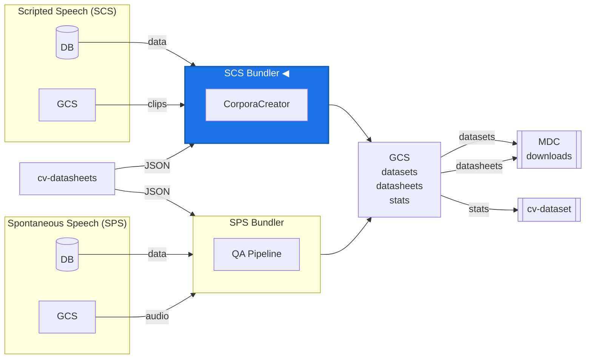

# Common Voice Dataset Bundler

Standalone service that packages per-locale Common Voice datasets into distributable `.tar.gz` archives, collects statistics, and generates datasheets.

For architecture, internals, and testing details see [DEVELOPER.md](DEVELOPER.md).

## Data Pipeline



---

## Release types

| Type         | Description                                                              |
| ------------ | ------------------------------------------------------------------------ |
| `full`       | Complete re-bundle of all clips for the release window                   |
| `delta`      | Only new clips since the last full release (no datasheets, no CC splits) |
| `statistics` | Re-runs stats and metadata only, no clip processing                      |
| `variants`   | Extracts variant subsets from a completed full release                   |

---

## CLI usage

Run from the bundler build output directory or from inside the bundler container:

```bash
cd bundler/js/cli    # local
# cd js/cli          # inside container
```

### Flags

| Flag               | Required                         | Description                                                                                   |
| ------------------ | -------------------------------- | --------------------------------------------------------------------------------------------- |
| `-t <type>`        | always                           | Release type: `full`, `delta`, `statistics`, `variants`                                       |
| `-u <datetime>`    | always                           | End of clip time window                                                                       |
| `-r <name>`        | always                           | Release name (e.g. `cv-corpus-25.0-2026-03-09`)                                               |
| `-p <name>`        | `full` only                      | Previous release to bootstrap clips from                                                      |
| `-d <file or URL>` | `full` only                      | Datasheets JSON filename or URL (see below)                                                   |
| `-f <datetime>`    | `delta` only                     | Start of clip time window (defaults to epoch)                                                 |
| `-l <locales...>`  | optional                         | Restrict to specific locales                                                                  |
| `--license-mode`   | optional (default: `unlicensed`) | `unlicensed`, `licensed`, or `both`                                                           |
| `--force`          | optional                         | Kill any in-progress run, flush its logs, and re-create all tarballs from scratch (see below) |
| `--verbosity`      | optional (default: `normal`)     | Output detail: `quiet`, `normal`, `verbose`, `debug` (see below)                              |

### Datasheets (`-d`)

The `-d` flag accepts a filename or a full URL. A plain filename is resolved against `DATASHEETS_BASE_URL` (defaults to the cv-datasheets `main` branch on GitHub).

```bash
# Filename -- resolved to https://raw.githubusercontent.com/.../releases/datasheets-2026-03-09.json
-d 'datasheets-2026-03-09.json'

# Full URL -- used as-is (useful for unmerged branches or specific commits)
-d 'https://raw.githubusercontent.com/common-voice/cv-datasheets/<commit>/releases/datasheets-2026-03-09.json'
```

### Examples

TL;DR: Example for v25.0 with cut-off at 2026-03-09 midnight

```bash
# We already have v24.0 full release until midnight of 2025-12-05
# First generate delta release for v25.0
node start-dataset-release.js \
  -t delta \
  -f "2025-12-06 00:00:00" \
  -u "2026-03-09 23:59:59" \
  -r "cv-corpus-25.0-delta-2026-03-09"

# Then generate full release for v25.0, bootstrapping from v24.0 and using the generated delta
node start-dataset-release.js \
  -t full \
  -u "2026-03-09 23:59:59" \
  -r "cv-corpus-25.0-2026-03-09" \
  -p "cv-corpus-24.0-2025-12-05" \
  -d "datasheets-2026-03-09.json"
```

More examples:

```bash
# Full release
node start-dataset-release.js \
  -t full -u '2026-03-09 23:59:59' \
  -r cv-corpus-25.0-2026-03-09 -p cv-corpus-24.0-2025-12-05 \
  -d 'datasheets-2026-03-09.json'

# Full release -- specific locales only
node start-dataset-release.js \
  -t full -u '2026-03-09 23:59:59' \
  -r cv-corpus-25.0-2026-03-09 -p cv-corpus-24.0-2025-12-05 \
  -d 'datasheets-2026-03-09.json' -l en tr de

# Full release -- licensed locales only
node start-dataset-release.js \
  -t full -u '2026-03-09 23:59:59' \
  -r cv-corpus-25.0-2026-03-09 -p cv-corpus-24.0-2025-12-05 \
  -d 'datasheets-2026-03-09.json' --license-mode licensed

# Full release -- both licensed and unlicensed (separate tarballs)
node start-dataset-release.js \
  -t full -u '2026-03-09 23:59:59' \
  -r cv-corpus-25.0-2026-03-09 -p cv-corpus-24.0-2025-12-05 \
  -d 'datasheets-2026-03-09.json' --license-mode both

# Delta release
node start-dataset-release.js \
  -t delta -f '2025-12-05 00:00:00' -u '2026-03-09 23:59:59' \
  -r cv-corpus-25.0-delta-2026-03-09

# Variant release
node start-dataset-release.js \
  -t variants -u '2026-03-09 23:59:59' \
  -r cv-corpus-25.0-2026-03-09

# Statistics only
node start-dataset-release.js \
  -t statistics -u '2026-03-09 23:59:59' \
  -r cv-corpus-25.0-2026-03-09

# Re-create a corrupt release (overwrites existing GCS files)
node start-dataset-release.js \
  -t full -u '2026-03-09 23:59:59' \
  -r cv-corpus-25.0-2026-03-09 -p cv-corpus-24.0-2025-12-05 \
  -d 'datasheets-2026-03-09.json' --force

# Re-create specific locales only
node start-dataset-release.js \
  -t full -u '2026-03-09 23:59:59' \
  -r cv-corpus-25.0-2026-03-09 -p cv-corpus-24.0-2025-12-05 \
  -d 'datasheets-2026-03-09.json' \
  -l en tr --force
```

---

## `--force` mode

Use `--force` to recover from a bad release run or re-generate tarballs after a pipeline bug.

### Full force (`--force` without `-l`)

Performs a complete reset -- use when the entire run is bad:

1. **Flushes partial-run logs** (problem-clips, process-log) to GCS so they are not lost.
2. **Obliterates the BullMQ queue** -- all active, waiting, and completed jobs are removed.
3. **Clears all Redis state** (done SET, processing HASH) so every locale is re-scheduled.
4. **Bypasses skip checks** -- tarballs are re-created and overwritten.

### Selective force (`--force -l en tr`)

Surgically re-processes only the specified locales without disrupting the rest of a running release:

1. **Removes only the targeted locales** from the done SET and processing HASH.
2. **Removes only their BullMQ jobs** (completed, failed, waiting, delayed). Other locales' jobs are untouched.
3. **Schedules new jobs** only for the specified locales.
4. Active jobs for targeted locales that are already running will finish harmlessly -- their Redis state was cleared, so the new jobs will supersede them.

### Crash recovery (without `--force`)

If a pod crashes mid-run, K8s restarts it and the worker resumes picking up jobs from the queue. Locales that were being processed by the crashed pod are automatically reclaimed after 20 minutes (stale-entry detection in the processing guard). No manual intervention is needed.

### End-of-run cleanup

After all locale jobs complete successfully, the bundler automatically:

- Deletes all release-scoped Redis keys (logs, counters, done/processing state)
- Drains all remaining BullMQ jobs from the queue

Redis keys have a 24-hour TTL as a safety net in case cleanup fails or the process crashes before reaching the end.

---

## `--verbosity` levels

Controls both the log output level and subprocess output detail. Levels: `quiet`, `normal` (default), `verbose`, `debug`. Overrides `LOG_LEVEL` when not `normal`. See [DEVELOPER.md](DEVELOPER.md#verbosity) for the full behaviour matrix.

---

## Configuration

All configuration is via environment variables:

| Variable                             | Default                | Description                                                  |
| ------------------------------------ | ---------------------- | ------------------------------------------------------------ |
| `ENVIRONMENT`                        | `local`                | `local`, `sandbox`, `staging`, `production`                  |
| `LOG_LEVEL`                          | derived                | `debug` / `info` / `warn` / `error` / `silent`               |
| `REDIS_URL`                          | `redis`                | BullMQ broker                                                |
| `DB_HOST`                            | `db`                   | MySQL host                                                   |
| `DB_PORT`                            | `3306`                 | MySQL port                                                   |
| `DB_DATABASE`                        | `voiceweb`             | MySQL database name                                          |
| `DB_USER`                            | `voicecommons`         | MySQL user                                                   |
| `DB_PASSWORD`                        | `voicecommons`         | MySQL password                                               |
| `CLIPS_BUCKET_NAME`                  | `common-voice-clips`   | GCS bucket for raw audio                                     |
| `DATASETS_BUNDLER_BUCKET_NAME`       | `common-voice-bundler` | GCS bucket for release output                                |
| `STORAGE_LOCAL_DEVELOPMENT_ENDPOINT` | `http://storage:8080`  | Local GCS emulator endpoint                                  |
| `DATASHEETS_BASE_URL`                | GitHub `main` branch   | Base URL for datasheets JSON; override to test from a branch |

---

## Commands

```bash
npm install          # Install dependencies
npm run build        # Build TypeScript
npm test             # Run tests
npm start            # Start the worker service (requires built JS)
```

> **Note:** A legacy CLI exists at `server/src/api/cli/start-dataset-release.ts` but uses the old `bull` library. It prints a deprecation warning if invoked.
