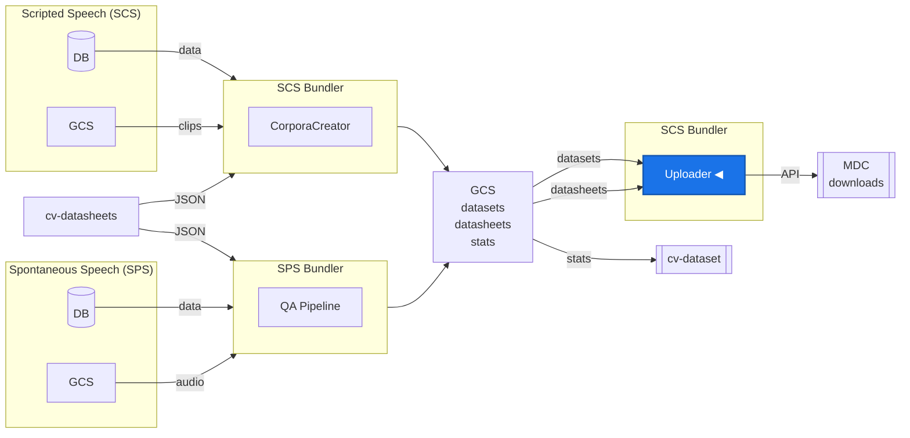

# MDC Uploader

CLI tool that uploads Common Voice release tarballs to [Mozilla Data Collective](https://datacollective.mozillafoundation.org/) (MDC) via the MDC API. Each upload includes a datasheet as metadata, displayed on the dataset page in MDC.

Supports both SCS (Scripted Speech) and SPS (Spontaneous Speech) releases, including full, delta, and future licensed, and variant dataset types.

For architecture and development details see [DEVELOPER.md](DEVELOPER.md).

## Capabilities

- Can upload release tarballs for all locales to MDC in a single batch run
- Can auto-detect available locales from the release directory (sorted smallest-first)
- Can upload specific locales only via `-l`
- Can attach datasheet metadata to each dataset submission for display on MDC
- Can handle full (CC0), delta (CC0), licensed (e.g. CC-BY 4.0), and variant release types
- Can retry only failed locales from a previous run via `--retry-failed`
- Can upload new file versions to existing MDC datasets via `--submission-id`
- Can preview uploads without calling MDC via `--dry-run`
- Can read files from local directories, GCS buckets (`gs://` URIs), or GCSFuse mounts (if available)
- Can handle 429 rate limiting with Retry-After awareness and automatic retries
- Can recover orphaned drafts on retry -- if upload succeeded but metadata update failed, `--retry-failed` skips re-upload and resumes from step 3
- Can log full HTTP request payloads and response bodies on error for debugging
- Can write all output to a log file via `--log-file` (always captures DEBUG level)
- Can persist batch state to JSON after each locale for `--retry-failed` support
- Can save log file and state JSON to `<base-dir>/<release>/upload-logs/` after each batch so they survive pod recycling

## Data Pipeline



## Authentication

API keys are created in the MDC platform under your profile settings. Dev and prod environments use separate accounts and keys.

Set the key for your target environment:

```bash
export MDC_API_KEY_DEV=your-dev-key
export MDC_API_KEY_PROD=your-prod-key
```

Not required for `--dry-run`.

## Quick Start

```bash
# Install
cd bundler/uploader
python3 -m venv .venv
source .venv/bin/activate
pip install -e .

# Dry run -- preview what would be uploaded
mdc-upload -r sps-corpus-3.0-2026-03-09 -ut dev --dry-run

# Upload a single locale to dev MDC (requires MDC_API_KEY_DEV)
mdc-upload -r sps-corpus-3.0-2026-03-09 -l ga-IE -ut dev

# Upload all locales to production (requires MDC_API_KEY_PROD)
mdc-upload -r cv-corpus-25.0-2026-03-09 -ut prod
```

## CLI Reference

```txt
mdc-upload [OPTIONS]

Required:
  -r,  --release TEXT                          Release name (e.g. cv-corpus-25.0-2026-03-09)

Optional:
  -ut, --upload-target [dev|prod]              MDC target environment (default: dev)
  -l,  --locales TEXT                          Space-separated locale codes (default: auto-detect)
  -rt, --release-type [full|delta|licensed|variants] Release type (default: full)
       --base-dir TEXT                         Root directory with release files (default: /gcs)
       --submission-id TEXT                    Existing MDC submission ID (version update mode)
       --retry-failed FILE                     State JSON from a previous run (retries failed only)
       --dry-run                               Preview without uploading
       --log-file PATH                         Write log output to file (always DEBUG level)
  -v,  --verbose                               Debug logging on console
  -h,  --help                                  Show help and exit
```

### Locale auto-detection

When `--locales` is omitted, the tool checks all known locales (from the Common Voice API) against the release directory and includes only those with existing tarballs. Locales are sorted smallest-first by file size.

### 429 Rate Limiting

When MDC returns a 429 response, the tool:

1. Reads the `Retry-After` header and waits the specified duration
2. Retries the same locale up to 3 times
3. If all retries fail, marks the locale as **failed** and continues to the next
4. The batch never aborts -- all failures are collected and shown in the summary

### Error Output

By default, errors show a single-line message. Use `-v` for full tracebacks:

```bash
# Clean error output (default)
[2026-03-13 14:30:00] [ERROR] [UPLOAD    ] Fatal: Invalid release name 'bad-name'
[2026-03-13 14:30:00] [ERROR] [UPLOAD    ] Re-run with -v for full traceback

# Verbose traceback
mdc-upload -r bad-name -ut dev -v
```

## Usage Examples

### Upload by release type

```bash
# Full (CC0) release -- default
mdc-upload -r cv-corpus-25.0-2026-03-09 -ut prod

# Delta (CC0) -- only new clips since last release
mdc-upload -r cv-corpus-25.0-delta-2026-03-09 -rt delta -ut prod

# Licensed (CC-BY 4.0) tarballs
mdc-upload -r cv-corpus-25.0-2026-03-09 -rt licensed -ut prod

# Variant datasets
mdc-upload -r cv-corpus-25.0-2026-03-09 -rt variants -ut prod
```

### Upload from a local directory (testing)

```bash
# Point --base-dir to a directory with the same structure as the GCS mount
mdc-upload -r sps-corpus-3.0-2026-03-09 --base-dir ./test-releases -ut dev -l ga-IE
```

### Upload specific locales

```bash
mdc-upload -r cv-corpus-25.0-2026-03-09 -ut prod -l "en ga-IE mt"
```

### Update an existing dataset

```bash
# Upload a new file version to an approved dataset on MDC
mdc-upload -r cv-corpus-26.0-2026-06-15 -l en --submission-id abc-123 -ut prod
```

### Retry failed locales

```bash
# After a batch run with failures, retry only the failed ones
mdc-upload --retry-failed ./upload-state-cv-corpus-25.0-2026-03-09-20260313T143000.json
```

## Directory Structure

`--base-dir` is the root directory containing release folders. The release name (`-r`) selects the subfolder. Tarballs and datasheets live inside it:

```txt
--base-dir /mnt/cv-datasets
               |
               +-- sps-corpus-3.0-2026-03-09/          <-- -r sps-corpus-3.0-2026-03-09
               |   +-- sps-corpus-3.0-2026-03-09-ga-IE.tar.gz    <-- tarball (per locale)
               |   +-- sps-corpus-3.0-2026-03-09-en.tar.gz
               |   +-- sps-corpus-3.0-2026-03-09-mt.tar.gz
               |   +-- datasheets/
               |   |   +-- sps-corpus-3.0-2026-03-09-datasheet-ga-IE.md  <-- datasheet (per locale)
               |   |   +-- sps-corpus-3.0-2026-03-09-datasheet-en.md
               |   |   +-- sps-corpus-3.0-2026-03-09-datasheet-mt.md
               |   +-- upload-logs/                                <-- auto-saved after each batch
               |       +-- mdc-upload-sps-corpus-3.0-...-20260322T143000.log
               |       +-- upload-state-sps-corpus-3.0-...-20260322T143000.json
               |
               +-- cv-corpus-25.0-2026-03-09/           <-- -r cv-corpus-25.0-2026-03-09
               |   +-- cv-corpus-25.0-2026-03-09-en.tar.gz
               |   +-- datasheets/
               |       +-- cv-datasheet-25.0-en.md
               |
               +-- cv-corpus-25.0-delta-2026-03-09/     <-- -r cv-corpus-25.0-delta-2026-03-09 -rt delta
               |   +-- cv-corpus-25.0-delta-2026-03-09-en.tar.gz
               |   +-- datasheets/
               |       +-- cv-datasheet-25.0-en.md
               |
               +-- cv-corpus-25.0-2026-03-09-licensed/  <-- -r cv-corpus-25.0-2026-03-09 -rt licensed
                   +-- cv-corpus-25.0-2026-03-09-en-CC-BY_4.0.tar.gz
                   +-- datasheets/
                       +-- cv-datasheet-25.0-en-CC-BY_4.0.md
```

Example mapping:

```bash
mdc-upload -r sps-corpus-3.0-2026-03-09 --base-dir /mnt/cv-datasets -ut dev -l ga-IE --dry-run
```

```txt
--base-dir  =  /mnt/cv-datasets
-r          =  sps-corpus-3.0-2026-03-09
-l          =  ga-IE

Tarball  :  /mnt/cv-datasets/sps-corpus-3.0-2026-03-09/sps-corpus-3.0-2026-03-09-ga-IE.tar.gz
Datasheet:  /mnt/cv-datasets/sps-corpus-3.0-2026-03-09/datasheets/sps-corpus-3.0-2026-03-09-datasheet-ga-IE.md
```

When `--locales` is omitted, the tool checks all known locales (from the CV API) against the release directory and includes only those with existing tarballs.

## Data Flow

The uploader reads tarballs from `--base-dir` and uploads them to MDC via the API. Each tarball is uploaded as a dataset submission, with the corresponding datasheet attached as metadata.

For `gs://` URIs, `google-cloud-storage` is included as a runtime dependency. See [DEVELOPER.md](DEVELOPER.md) for details.

## Release Name Conventions

| Modality | Type  | Format                          | Example                           |
| -------- | ----- | ------------------------------- | --------------------------------- |
| SCS      | full  | `cv-corpus-{ver}-{date}`        | `cv-corpus-25.0-2026-03-09`       |
| SCS      | delta | `cv-corpus-{ver}-delta-{date}`  | `cv-corpus-25.0-delta-2026-03-09` |
| SPS      | full  | `sps-corpus-{ver}-{date}`       | `sps-corpus-3.0-2026-03-09`       |
| SPS      | delta | `sps-corpus-{ver}-delta-{date}` | `sps-corpus-3.0-delta-2026-03-09` |

## MDC Targets

| Target | URL                                                    |
| ------ | ------------------------------------------------------ |
| dev    | `https://dev.datacollective.mozillafoundation.org/api` |
| prod   | `https://datacollective.mozillafoundation.org/api`     |
